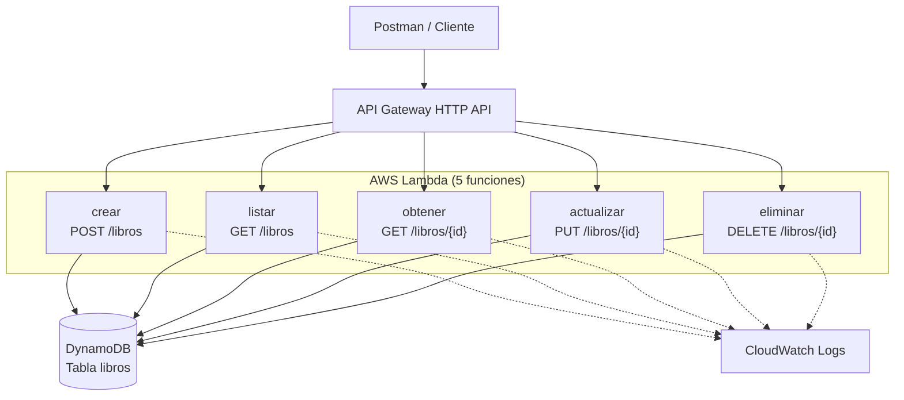

# Arquitectura — Laboratorio 3 (Libros)

## Descripción

La API es completamente serverless. El cliente (Postman) llama a un endpoint HTTP
expuesto por API Gateway (HTTP API), que enruta la petición a la función Lambda
correspondiente a la operación solicitada. Cada Lambda lee o escribe en la misma
tabla de DynamoDB usando el AWS SDK v3, y todas las funciones envían sus logs de
ejecución a CloudWatch Logs.

No hay servidores que administrar: API Gateway, Lambda y DynamoDB escalan de
forma automática y solo se paga por el uso real (DynamoDB en modo
`PAY_PER_REQUEST` y Lambda por invocación).

## Diagrama

## Componentes

| Componente | Rol |
|---|---|
| API Gateway (HTTP API) | Expone las 5 rutas públicas y enruta cada método/ruta a su Lambda |
| AWS Lambda (5 funciones) | Una función independiente por operación CRUD, sin servidor que mantener |
| Amazon DynamoDB | Tabla `libros`, partition key `id` (String), modo `PAY_PER_REQUEST` |
| CloudWatch Logs | Recibe automáticamente los logs de cada invocación de Lambda |
| CloudFormation | Generado por Serverless Framework a partir de `serverless.yml`; define y versiona toda la infraestructura |

## Por qué una Lambda por operación

Separar `crear`, `listar`, `obtener`, `actualizar` y `eliminar` en funciones
independientes permite:

- Aplicar permisos IAM distintos por función si en el futuro se necesitara
  (principio de mínimo privilegio más granular).
- Que un error o un despliegue de una operación no afecte a las demás.
- Que cada función tenga un tamaño de paquete y un tiempo de arranque en frío
  más pequeños, en lugar de cargar toda la lógica del CRUD en una sola función.
